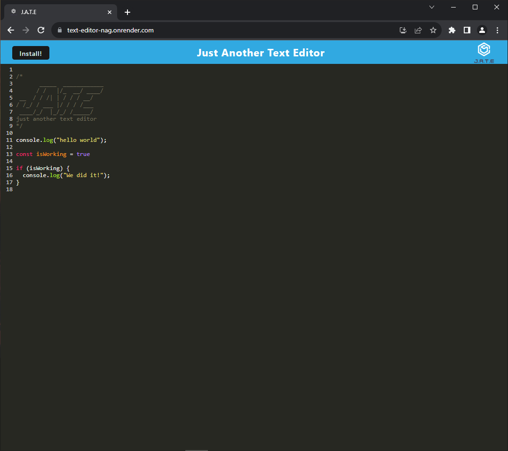
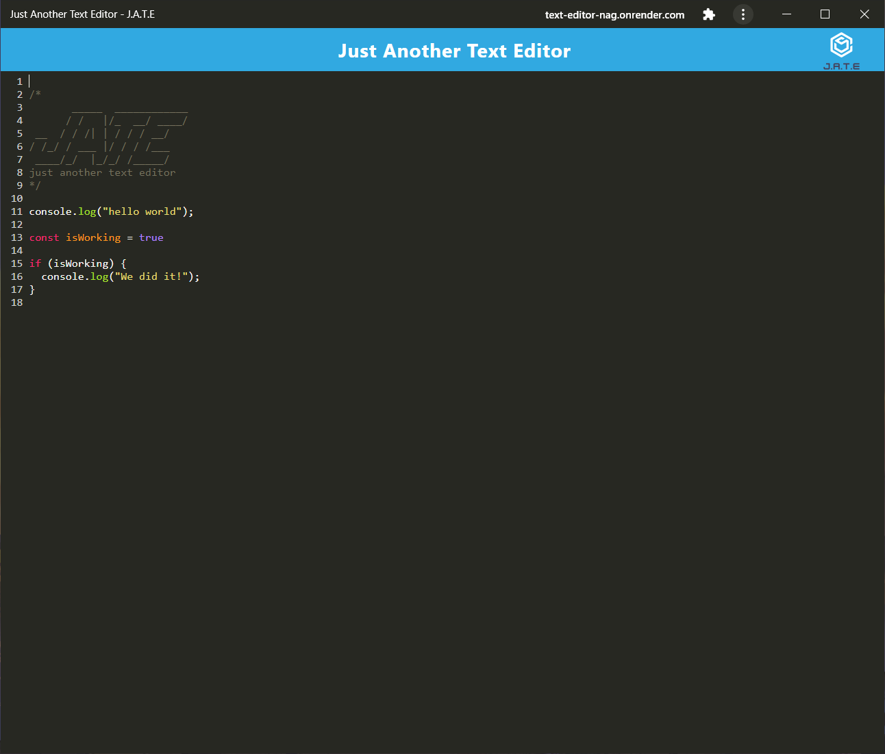

# Online Text Editor

## Description

This is an online text editor that preserves your input so you can come back to it later. It runs off of Webpack and the typical HTML, JavaScript, CSS front-end. It has color coding to represent different keywords like `const`, `true`, `console.log`, `"strings"`, etc. Feel free to use it as you please. 

This site also allows for offline functionality via a service worker. This site can also be installed as a Progressive Web App (PWA) if using supported browsers like Google Chrome.

You can view the website here: [https://text-editor-nag.onrender.com](https://text-editor-nag.onrender.com)

### How this site works

* The user input is saved in an IndexedDB collection called "jate". 
* The database is updated when the user clicks off the editor.
* The backend is supported by a service called Render, and its documentation can be found [at this link](https://render.com/docs)

## Learning Points

* Webpack likes to put hash strings for files unless specified otherwise. This made cacheing images a little tricky.
* Chrome requires a PWA to have at least 1 icon that's 512x512 in order for it to work.
* Chrome will automatically detect if a PWA can be installed or not. For example, if you install the PWA, the browser will change its icon to opening the PWA.

## Images

Image of the website showing it can be installed as a PWA.

Image of the PWA

## Credits

[Loading img source inside the dist directory](https://stackoverflow.com/a/47127094)

### Resoureces

[Trigger PWA installation from a button](https://developer.mozilla.org/en-US/docs/Web/Progressive_web_apps/How_to/Trigger_install_prompt)